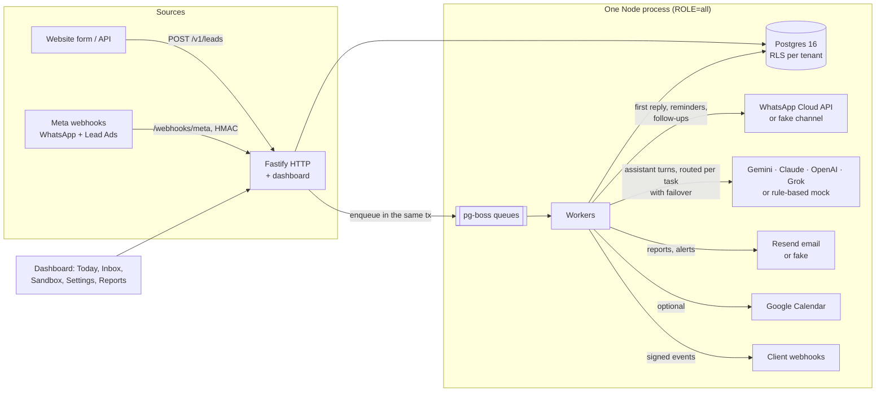

# InstantLead

Every enquiry a clinic gets — website form, Facebook/Instagram lead ad, click-to-WhatsApp — gets a
WhatsApp reply in under a minute, in English, Hindi or Hinglish. An AI assistant qualifies the lead,
books an appointment into the clinic's real availability, sends reminders, recovers no-shows, asks
happy patients for a Google review, follows up with silent leads, and emails the owner a weekly
report with numbers counted from the database. A real-estate preset (site visits) ships too.

Official WhatsApp Cloud API only. Everything runs in **mock mode with zero credentials**.

The assistant is built to take anything a customer sends (symptoms in their own words, several questions at once,
Hindi or Hinglish, photos, voice notes, spam, vendor pitches, other bots, prompt injection) and reply like a warm
receptionist, behind deterministic guardrails. It runs on Gemini Flash-Lite by default (3.1 for most turns, 3.5 for
complex ones, a 2.5 judge only when rules cannot tell), with optional Claude, OpenAI or Grok per clinic, routed per task
with automatic failover.

## Quick start (mock mode)

Needs Node 24 LTS and pnpm 12.

```bash
cp .env.example .env
pnpm install
pnpm db:local          # terminal 1: Postgres 16 without Docker (or: docker compose up -d db)
pnpm db:migrate && pnpm db:seed
pnpm build && pnpm dev # terminal 2: API + workers + dashboard on http://localhost:3000
```

Sign in as `admin@demo-clinic.test` / `dev-demo-password` and open **Demo sandbox**.
With Docker: `docker compose up -d --build`, then `docker compose exec app node apps/api/src/system/seed.ts`.

```bash
pnpm demo        # the 4 acceptance scenarios against the running app
pnpm loadtest    # 100 leads in 20 s; passes when p95 first reply < 60 s (--mix adds 60 chatting customers and a reminder burst)
pnpm sim         # 10 scripted lead personas against the assistant
pnpm e2e         # Playwright smoke test (desktop + mobile)
pnpm evals       # assistant quality across AI providers with keys ($8 cap) -> docs/EVALS.md
pnpm test        # 180+ unit/API/DB tests (embedded Postgres, no Docker needed)
```

## Architecture



- **Tenancy:** every tenant table has Postgres row-level security; app code only reaches tenant data through `withTenant()`.
- **Jobs:** enqueued in the same transaction as the data that caused them, so nothing is lost or sent twice.
- **Clock:** business times come from an injected clock; the demo fast-forwards it to show day-2 follow-ups and Monday reports in seconds.
- **No build step for the backend:** Node 24 runs the TypeScript directly; only the dashboard is built.

| Path                    | What                                                                                       |
| ----------------------- | ------------------------------------------------------------------------------------------ |
| `apps/api`              | HTTP, webhooks, workers, DB schema + migrations                                            |
| `apps/dashboard`        | React dashboard (served by the API)                                                        |
| `packages/core`         | Pure domain logic: lead state machine, scoring, availability, quiet hours                  |
| `packages/config`       | Tenant config schema, presets, WhatsApp template registry                                  |
| `packages/integrations` | WhatsApp, Meta Lead Ads, LLM providers, email, two-way Google Calendar (+ in-memory fakes) |
| `packages/sim`          | Simulator, `pnpm demo`, `pnpm loadtest`                                                    |

## Docs

- [ONBOARDING](docs/ONBOARDING.md) — take a new clinic live in under a day, no code changes
- [DEMO-SCRIPT](docs/DEMO-SCRIPT.md) — the 10-minute sales demo
- [OPERATIONS](docs/OPERATIONS.md) — deploy (India VPS + Caddy), backups, monitoring, secrets rotation, incidents
- [PRIVACY](docs/PRIVACY.md) — DPDP Act: consent, opt-out, retention, erasure, export, breaches
- [GO-LIVE](docs/GO-LIVE.md) — what you do outside the code, the live test script, and the gap table
- [GOOGLE-CALENDAR](docs/GOOGLE-CALENDAR.md) · [LEAD-SOURCES](docs/LEAD-SOURCES.md) · [SECURITY](docs/SECURITY.md)
- [TEMPLATES-TO-SUBMIT](docs/TEMPLATES-TO-SUBMIT.md) — WhatsApp templates each client submits to Meta
- [PROGRESS](docs/PROGRESS.md) · [DECISIONS](docs/DECISIONS.md) · [ROADMAP](docs/ROADMAP.md)
